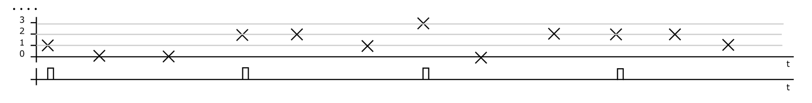

# Question
Obrázek ukazuje průběh 4 period signálu (nahoře), odpovídající synchronizační signál je dole. Vypište hodnoty vzorků výsledného signálu po synchronním průměrování: vzorek 1 ... vzorek 2 ... vzorek 3

*(Pozn.: Hodnoty jsou odhadnuty z grafu v zadání)*

---
# Solution
**Výsledek:** Vzorek 1: **1.5**, Vzorek 2: **1.5**

## Explanation
Synchronní průměrování (Synchronous Averaging) se používá k potlačení nesynchronního šumu a zvýraznění periodické složky signálu. Princip spočívá v sečtení odpovídajících si vzorků v každé periodě a jejich vydělení počtem period ($N$).

Z grafu odečteme hodnoty signálu (označené křížkem) v jednotlivých periodách pro dva časové okamžiky (vzorky) definované mřížkou:

**Vzorek 1 (první křížek v periodě):**
- Perioda 1: $x_{1,1} = 1$
- Perioda 2: $x_{2,1} = 2$
- Perioda 3: $x_{3,1} = 1$
- Perioda 4: $x_{4,1} = 2$
- Průměr: $\bar{x}_1 = \frac{1+2+1+2}{4} = \frac{6}{4} = 1.5$

**Vzorek 2 (druhý křížek v periodě):**
- Perioda 1: $x_{1,2} = 0$
- Perioda 2: $x_{2,2} = 2$
- Perioda 3: $x_{3,2} = 3$
- Perioda 4: $x_{4,2} = 1$
- Průměr: $\bar{x}_2 = \frac{0+2+3+1}{4} = \frac{6}{4} = 1.5$

(Pokud by existoval vzorek 3, postupovalo by se analogicky, ale v grafu jsou jasně definované tyto dva body na periodu).

### Steps / Derivation
1. Identifikace period podle synchronizačních pulzů.
2. Odečtení hodnot $x_i[k]$ pro $k$-tý vzorek v $i$-té periodě.
3. Výpočet průměru: $y[k] = \frac{1}{M} \sum_{i=1}^{M} x_i[k]$.
$$
\bar{x}[n] = \frac{1}{N} \sum_{k=0}^{N-1} x(n + kP)
$$

## Related Concepts
- [[Synchronní průměrování]]
- [[Zlepšení poměru signál/šum]]
