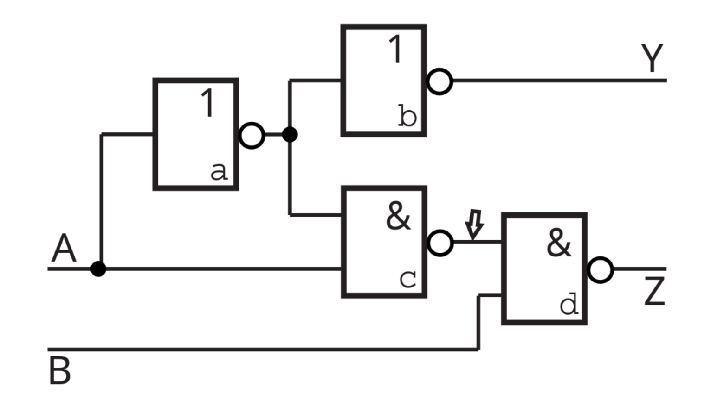

# Question

V obvodu se vstupy A,B a výstupy Y, Z navrhněte kroky testu pro detekci poruchy typu stuck-at-0 a stuck-at-1 na výstupu členu a a d(2b.). Rozhodněte, zda výstup členu c (označený šipkou) je plně pozorovatelný (2b.) a řiditelný (2b.).

*Schéma (popis):*
- Hradlo **a**: NOT(A)
- Hradlo **b** (Y): OR(výstup a, B)
- Hradlo **c**: AND(výstup a, B)
- Hradlo **d** (Z): AND(výstup c, B)

---
# Solution

### 1. Testy pro detekci poruch (člen a, d)

**Poruchy členu a (výstup hradla NOT A):**
- **S-a-0 (Porucha a=0):**
    - Aktivace poruchy: Potřebujeme `a=1` $\implies$ Vstup `A=0`.
    - Propagace na výstup (pozorování):
        - Cesta přes Y (OR): Aby bylo `a` vidět na Y (`a + B`), musí být `B=0`.
            - Test: `A=0, B=0`. Očekáváme Y=1 (protože a=1). Při poruše a=0 bude Y=0. $\rightarrow$ Detekuje.
        - Cesta přes Z (AND -> AND): Aby bylo `a` vidět na Z (`a . B . B`), musí být `B=1`.
            - Test: `A=0, B=1`. Očekáváme Z=1 (protože a=1, B=1). Při poruše a=0 bude Z=0. $\rightarrow$ Detekuje.
    - **Test pro a/0:** Sektor `[0, 0]` nebo `[0, 1]`.

- **S-a-1 (Porucha a=1):**
    - Aktivace poruchy: Potřebujeme `a=0` $\implies$ Vstup `A=1`.
    - Propagace na výstup:
        - Cesta přes Y (OR): `B=0`.
            - Test: `A=1, B=0`. Očekáváme `a=0 \implies Y=0`. Při poruše a=1 bude Y=1. $\rightarrow$ Detekuje.
        - Cesta přes Z (AND): `B=1`.
            - Test: `A=1, B=1`. Očekáváme `a=0 \implies Z=0`. Při poruše a=1 bude Z=1. $\rightarrow$ Detekuje.
    - **Test pro a/1:** Vektor `[1, 0]` nebo `[1, 1]`.

**Poruchy členu d (výstup hradla AND -> Z):**
- **S-a-0 (Porucha Z=0):**
    - Aktivace: Potřebujeme `Z=1`. To vyžaduje výstup c=1 a B=1.
        - c=1 vyžaduje a=1 (A=0) a B=1.
    - **Test:** `A=0, B=1`. Očekáváme Z=1. Při poruše Z=0. $\rightarrow$ Detekuje.
- **S-a-1 (Porucha Z=1):**
    - Aktivace: Potřebujeme `Z=0`. To vyžaduje c=0 nebo B=0.
    - Test: `A=1, B=1` (pak c=0, ale B=1, Z má být 0). Při poruše Z=1. $\rightarrow$ Detekuje.
    - Nebo `A=x, B=0` (Z má být 0).

### 2. Řiditelnost a pozorovatelnost členu c

**Bod c (výstup AND hradla: `c = (NOT A) AND B`):**

- **Řiditelnost (Controllability):**
    - Lze nastavit c na 1? Ano, `A=0, B=1` $\implies$ `c = 1 . 1 = 1`.
    - Lze nastavit c na 0? Ano, `A=1` (pak `c=0` bez ohledu na B) nebo `B=0`.
    - **Závěr:** Bod c je **plně řiditelný**.

- **Pozorovatelnost (Observability):**
    - Lze změnu na c propagovat na výstup?
    - Signál z c jde do hradla **d** (AND). Druhý vstup hradla d je B.
    - Abychom pozorovali c na výstupu Z, musí být druhý vstup hradla d nastaven na propustnou hodnotu (log 1 pro AND). Tedy musíme nastavit `B=1`.
    - Pokud nastavíme `B=1`:
        - Pokud chceme testovat c=1 $\implies$ `A=0, B=1`. Výstup Z=1. (OK)
        - Pokud chceme testovat c=0 $\implies$ musíme mít `c=0` při zachování `B=1`. Toho docílíme nastavením `A=1`. Pak `c=0`, `B=1` $\implies$ `Z=0`. Pokud by c neslo 1 (chyba), Z by bylo 1.
    - Jelikož jsme schopni nastavit podmínky pro přenos hodnoty c na výstup Z, je bod c **pozorovatelný**.
    - **Závěr:** Bod c je **plně pozorovatelný**.

## Explanation
Obvod kombinuje logiku negace a hradel. Klíčem je sensitizace cesty - nastavení ne-testovaných vstupů hradel na neutrální hodnoty (0 pro OR, 1 pro AND), aby se změna testovaného uzlu projevila na výstupu.

### Steps / Derivation
1. a = NOT(A)
2. c = a AND B
3. Z = c AND B = (NOT A AND B) AND B = NOT A AND B
4. Y = a OR B = NOT A OR B
$$
Z = \bar{A} \cdot B
$$

## Related Concepts
- [[Testování číslicových obvodů]]
- [[Path Sensitization]]
- [[Řiditelnost a pozorovatelnost (SCOAP)]]
